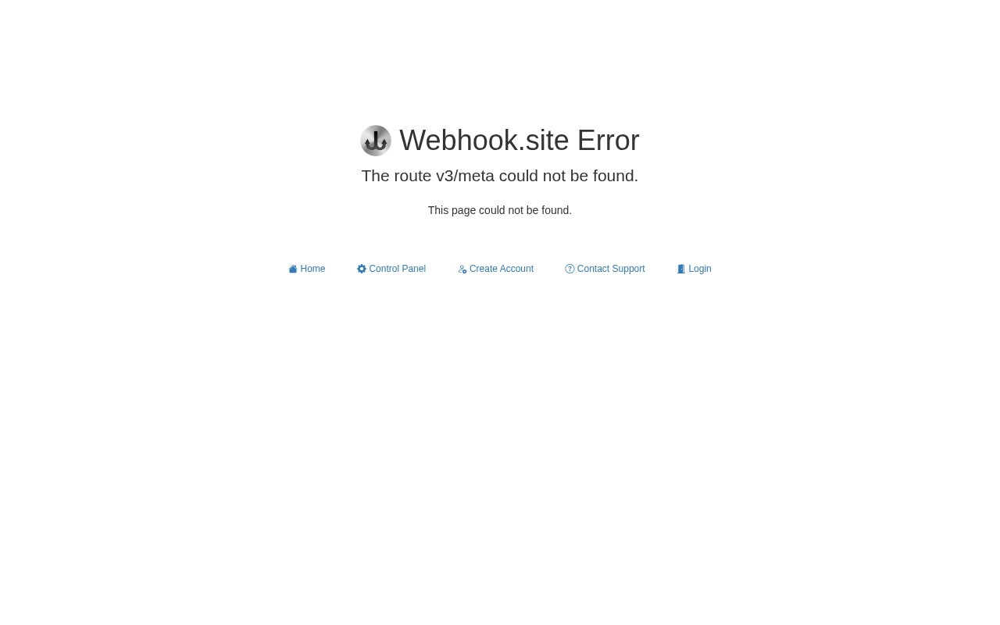
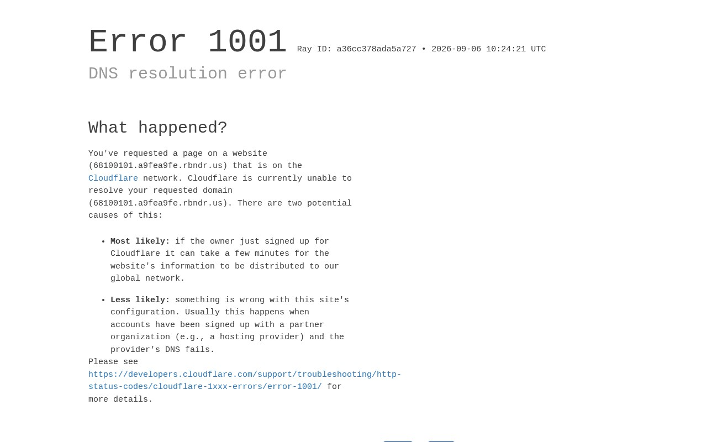
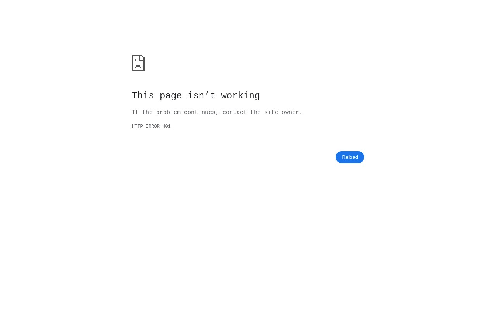
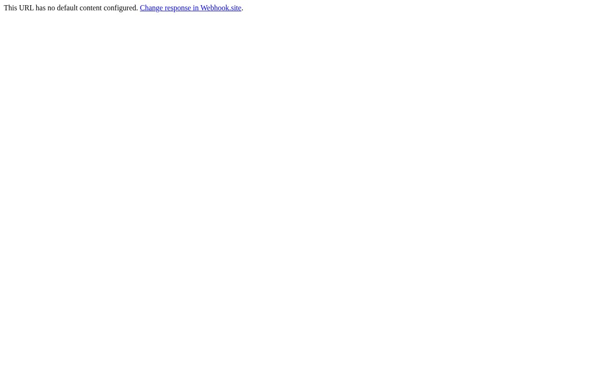
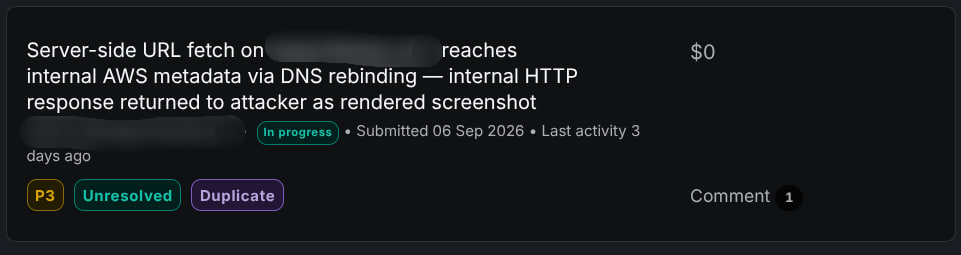

# The Screenshot Feature That Called Home: from a Sign-Up Wizard to AWS Metadata

*This is the story of how a standard "enter your website" onboarding screen turned into a server-side request forgery that reached the target's cloud metadata service. Tested against my own free account only. Screenshots referenced below are in `evidence/`.*

---

It starts the boring way. I created a free account on the target, answered a couple of onboarding questions, and the wizard eventually asked me for my website URL. Type it in, click next, and the platform goes out to fetch that page, it scrapes the metadata and renders a little screenshot so the product can "learn your brand." You've seen this feature in a hundred SaaS products. You've probably never thought twice about it.

But the shape of it is one every bug hunter recognizes instantly: a text field, a server, a URL, a fetch. Somewhere behind that friendly spinner there's a machine dialing out to wherever I tell it to go. That's an SSRF candidate wearing a friendly onboarding costume.

How did I get to the actual endpoint? Not from reading JavaScript. I logged in with Burp suite running and walked through the onboarding wizard like a normal user. When I typed my website URL and hit next, the wizard itself fired the API call, and the Burp history captured the whole thing: the endpoint path, the method, the session cookie, a CSRF token header, and the JSON body with my URL in it. One captured request, and the feature was fully mapped. From that point on I didn't need the wizard at all, just the same POST replayed by hand with any URL I wanted.

## Step one: watch what it actually does

Before touching any payload, I did the least glamorous thing in the world, I gave it a URL I control and watched what arrived.

I made an endpoint on webhook.site, dropped it into the onboarding box, and waited. A few seconds later the webhook's request log filled up, and that single log told me more than an hour of probing would have:

The fetches arrive with a self-identifying user agent (a scraper UA naming the vendor redacted here as `<redacted>/1.0`). More interesting: my webhook log did not show one machine at work. It showed two distinct groups of requests. The metadata fetcher hits my webhook from a rotating pool of IPs, and when a screenshot is produced, a headless Chromium, a completely different host identifiable by its own HeadlessChrome user agent, makes its own request from yet another IP. Two machines, two jobs: one fetches the page for metadata, the other one drives a browser to render it. I didn't have to guess the hosting: the webhook log records the source IP of every hit, and a quick cross-check against AWS's publicly published IP ranges (`ip-ranges.amazonaws.com/ip-ranges.json`) put every fetcher address inside EC2 us-east-1, the outbound fleet is plain EC2 instances.

The webhook log also showed the fetcher happily chasing a 302 I served it. And here's the detail that reframed the whole hunt: I returned a deliberate 404 from my webhook, and the screenshot feature handed me back a JPEG of *that exact 404 page*, rendered by their internal browser. Whatever the server-side fetcher sees, I get to see as an image, delivered straight back into my session.



So the pipeline, mapped: my browser → their API → something that validates my URL → something else that fetches it on AWS → headless Chromium renders the result → the JPEG lands in my dashboard. An SSRF here would not be blind. If that fetcher ever reaches an internal host, the internal host's response gets painted and shipped to me. All that was left to figure out was whether the validator and the fetcher agree about what counts as "internal."

## Step two: the wall

The validator is genuinely good. I threw the standard zoo at the screenshot endpoint and the metadata endpoint behind it, and everything came back with a 400: direct IPs like `169.254.169.254` and `127.0.0.1`, plain `localhost`, hex and integer encodings, nip.io and sslip.io pointing at private space, IPv6 loopback forms. This is a maintained blocklist, not a decorative one. Honestly, most hunts would end here with "target is hardened" and move on.

And this is the moment I think matters most in a hunt like this. Every public write-up says this feature shape *should* be vulnerable. Every payload I have says it isn't. When your training data and your probes disagree, stop testing payloads and start testing architecture.

## Step three: the seam

Two facts from the webhook log were quietly more important than any payload.

The validator and the fetcher are separate processes on separate machines. And the fetcher resolves my hostname *itself* meaning the target makes **two** DNS lookups for every screenshot: one when the validator checks "is this IP allowed?", and a second, milliseconds later, when the fetcher actually connects.

Two lookups, two machines, two moments in time. The whole security model rests on an assumption nobody wrote down: that the first lookup's answer is still true for the second one.

I'd already seen a preview of that seam in an earlier session. When I sent a public redirector pointing at the metadata IP `httpbin.org/redirect-to?url=http://169.254.169.254/...` the validator happily approved the redirector (it's public, why wouldn't it). The internal metadata address never went through the validator at all; it only ever existed inside the redirect target. So the input check is first-hop only: it validates what you type, never where the redirect sends you.

But this vector currently does not land. How do I know? Because of what came back. If the fetcher had actually reached the metadata service through the redirect, the screenshotter would have painted a real page and I would have seen something like the 401 page I later got via the rebind. Instead, what came back was a generic rejection render: a short "URL rejected" notice, or the app's plain "couldn't load this page" placeholder. No internal content, no metadata, nothing. Same endpoint, same pipeline, but the redirect never rendered the fetcher followed it, then something later in the pipeline stepped in and refused to render the final destination.

So the redirect probe was a clue, not an exploit: it proved the validator only looks at the first hop, while something downstream watches the last one. The seam that actually opens is the place nobody watches the split moment between the validator's DNS lookup and the fetcher's. That's what the rebind walks straight through.

If the DNS server were willing to change its answer between those two lookups, the blocklist wouldn't matter, because the validator would never see the internal IP. That's a DNS rebinding TOCTOU time-of-check, time-of-use.

## Step four: the rebind, made deterministic

I needed a hostname whose DNS answer flips between "boring public IP" and "169.254.169.254" on consecutive lookups. The free service 1u.ms does exactly that, and the syntax is beautifully self-describing. The IPs you want are literally encoded in the hostname; the service's DNS server reads them out at query time:

```
make-<IP1>-rebind-<IP2>-rr.1u.ms
```

For example, per 1u.ms's own docs, `make-1.2.3.4-rebind-169.254.169.254-rr.1u.ms` resolves to `1.2.3.4` on the first lookup and to `169.254.169.254` on the second.

The `-rr` suffix makes it a state machine rather than a coin flip: the first resolution in any five-second window returns `<IP1>`, and every resolution after that still inside the window returns `<IP2>`. That distinction is the difference between "I got lucky once" and "this works on demand."

One practical variant: 1u.ms also accepts a random session stub wrapped around the name, like `z<rand>-make-<IP1>-rebind-<IP2>-rr.y<rand>.1u.ms`. The stub does nothing to the behavior; it exists purely as a cache-buster, so every fresh query hits a hostname that has never been resolved before. That matters against targets whose resolvers cache aggressively, and it's the form I actually used in testing.

(Why `169.254.169.254` and not some RFC-1918 address? Because the webhook log already told me the outbound fleet is AWS EC2, so the link-local metadata service is the highest-value internal target on that network, and the ECS task-metadata address confirmed it.) That distinction is the difference between "I got lucky once" and "this works on demand." (Why `169.254.169.254` and not some RFC-1918 address? Because the webhook log already told me the outbound fleet is AWS EC2 so the link-local metadata service is the highest-value internal target on that network, and the ECS task-metadata address confirmed it.)

Before spending a single request against the target, I verified the alternation myself:

```bash
$ dig +short make-104.16.1.1-rebind-169.254.169.254-rr.1u.ms
104.16.1.1
$ dig +short make-104.16.1.1-rebind-169.254.169.254-rr.1u.ms
169.254.169.254
$ dig +short make-104.16.1.1-rebind-169.254.169.254-rr.1u.ms
169.254.169.254
```

First answer public. Then it flips, and *stays* flipped inside the window. The validator will see the public IP on its lookup; the fetcher will see the metadata IP on its second lookup, and both happen while the scraper is still processing my job, so both land inside the window. That's the whole exploit. Everything after this is bookkeeping.

## Step four: firing it

Same POST from step one, aimed at a freshly minted rebind name:

```bash
curl -s -X POST https://www.<redacted>.com/website-metadata-scraper/ajax/screenshot \
  -H "Cookie: <session_cookie>=<yours>" \
  -H "Content-Type: application/json" \
  -d '{"url": "http://make-104.16.1.1-rebind-169.254.169.254-rr.1u.ms/latest/meta-data/"}'
```

The first submit resolved on the public side and I got back a screenshot of Cloudflare's "Error 1001" page that's what the public anchor returns when the DNS answer points somewhere private. Fine, that's the validator's world:



The second submit, a few seconds later, still inside the same DNS window, resolved the other way. And the screenshot that came back looked like nothing I'd seen in the whole session not the app's error page, not my webhook, but Chromium's own built-in chrome-error screen:



*"HTTP ERROR 401 This page isn't working."* That page is only ever painted by a browser that navigated to a server which answered 401 Unauthorized. The cloud metadata service on AWS requires an IMDSv2 token header, and without one it returns exactly that. So the sequence that produced this JPEG is not guessable away: the target's headless Chromium, running inside their own AWS environment, navigated to `169.254.169.254/latest/meta-data/`, the metadata service answered from *inside* their network, Chromium painted the response, and the platform shipped the rendered image back to my session as a screenshot.

One same URL, two different worlds, a few seconds apart. The validator approved the public answer; the fetcher connected to the internal one. For contrast, here's what a healthy render looks like:



## Step five: stopping at the 401

The obvious next hop is the IAM credentials path under the metadata root. I didn't take it, and I want to explain why, because it's the part most people get wrong in write-ups.

The program's policy on credentials is unambiguous: if you reach them, you stop and report. But there's also a cleaner reason. The 401 already proves everything the bug needs to prove an internal, normally unreachable host is reachable through this feature, and it *answers*. Reading keys adds nothing to the finding except risk. As it happens, that host enforces IMDSv2, so the credential path needs a token request first; I never made one. The 401 is not a partial win I'm dressing up it's the clean, complete version of the proof.

--

## A closing note on the technique

The whole exploit rests on one idea: **TOCTOU via DNS rebinding** the validator's view of a hostname and the fetcher's view of the same hostname are two independent DNS queries, and anything that lets those queries disagree (a rebinding DNS server) breaks the check. The 1u.ms round-robin form (`-rr`) turns that race into a deterministic state machine: first lookup in the window gets the public IP, everything after gets the internal one, which converts the exploit from "retry until lucky" into "follow the sequence."

If you want to go deeper on this class, these are the resources I'd point at:

- **[1u.ms](http://1u.ms)**, the rebinding DNS service used here; the `make-<IP1>-rebind-<IP2>-rr.1u.ms` state machine syntax is documented on the front page.
- **AWS documentation on [IMDSv2](https://docs.aws.amazon.com/AWSEC2/latest/UserGuide/configuring-instance-metadata-service.html)**, token-based metadata access; worth reading to understand why the 401 render is both a clean PoC and a hard stop.
- **[AWS public IP ranges JSON](https://ip-ranges.amazonaws.com/ip-ranges.json)**, the same file I used to attribute the fetcher IPs to EC2 us-east-1.
- **[webhook.site](https://webhook.site)**, free request-capture service; what I used to observe the fetcher behavior in Step one.
- SSRF cheat-sheet style lists ([PortSwigger's SSRF material](https://portswigger.net/web-security/ssrf)) cover the payload zoo. Useful, but only after you've understood that the real bug lives in the architecture, not in the encoding trick.

## Disclosure status

I reported this through the vendor's public bug bounty program on the day I finished testing. Triage accepted it as a valid P3, but closed it as a **Duplicate** the same weakness had already been reported by another researcher, so no bounty.


